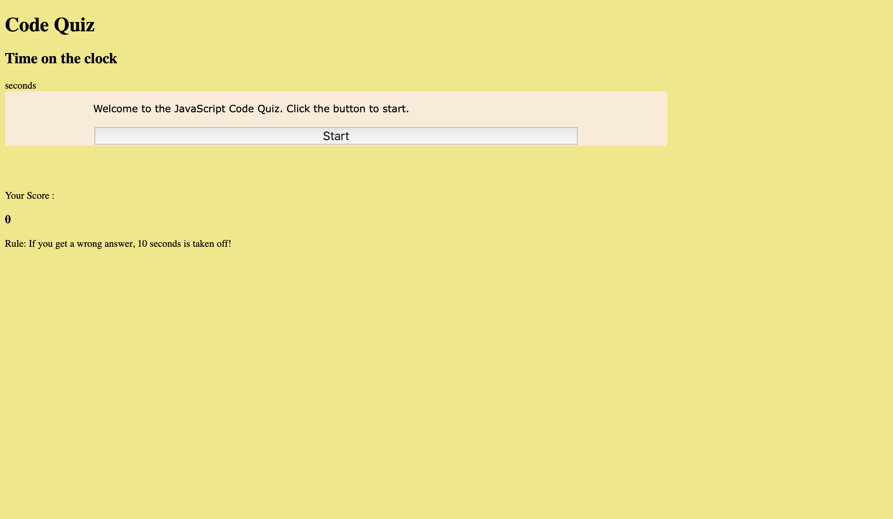

# Code Quiz

Visit the deployed site at https://osuchaya.github.com/codequiz

Screenshot of deployed site:

## Technology Used 

| Technology Used         | Resource URL           | 
| ------------- |:-------------:| 
| HTML    | [https://developer.mozilla.org/en-US/docs/Web/HTML](https://developer.mozilla.org/en-US/docs/Web/HTML) | 
| CSS     | [https://developer.mozilla.org/en-US/docs/Web/CSS](https://developer.mozilla.org/en-US/docs/Web/CSS)      |   
| Git | [https://git-scm.com/](https://git-scm.com/)     |    
| JavaScript | [https://developer.mozilla.org/en-US/docs/Web/JavaScript](https://developer.mozilla.org/en-US/docs/Web/JavaScript) |
| Web API | [https://developer.mozilla.org/en-US/docs/Web/API] | (https://developer.mozilla.org/en-US/docs/Web/API) |

## Description

This application is part of module 4 on Web APIs where the objective is to develop a timed quiz on JavaScript fundamentals that stores high scores so the player can gauge his progress compared to other players. The requirements of the quiz is such that upon pressing the start button, a timer starts and questions are presented sequentially. If a question is answered incorrectly, time is subtracted from the clock. When either all questions are answered or timer reaches zero, the game is over and the player can save his initials and score.

## Learning points
The author learned to apply what is learnt during JavaScript module and Web APIs module in order to add an interactive interface to the application. Through this exercise, the author learned to think computationally which is an important skill for web developers. The author also learned how Web APIs can assist developers in adding functions to HTML elements as well as how to store information in local storage of the computer's browser and retrieve information using the JSON stringify and JSON pars method. The user also gets to practice with eventlistener function and to display elements.

## Credits
Resources were consulted to complete this application. This includes https://www.w3schools.com/js/default.asp and tutor who helped to explain how functions execute for thorough understanding of the project.

## Author Information
* [Portfolio] (https://osuchaya.github.io/challenge2/)
* [LinkedIn] (https://www.linkedin.com/in/suchaya-osatis-0b81a378/)
* [Github] (https://github.com/osuchaya)

## License
The license associated with this project is MIT license which was used to create the repository for this project.